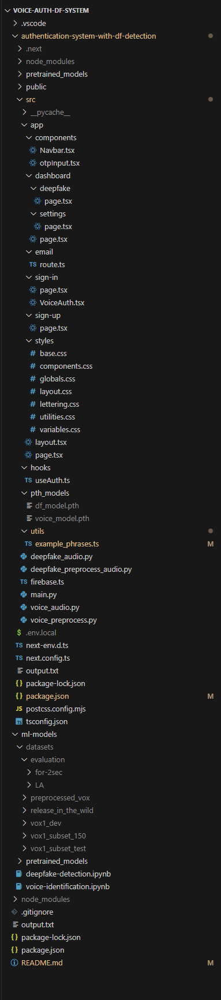

# Voice Authentication System With Deepfake Detection

A secure voice authentication system with deepfake audio detection. This project supports real-time voice-based login with spoof detection, integrated with Firebase for authentication and Whisper for transcription for speech independant verification and authentication.


## 1. Clone the Repository

Enure you have git installed for your system, https://git-scm.com/downloads
First, clone the repository to your desired location using terminal or command prompt:

```bash
git clone https://github.com/Aadil29/Voice-Auth-DF-System.git
```

```bash
cd Voice-Auth-DF-System
```

---

## 2. Environment Setup

### 2.1 Install Conda

Download and install Conda for your system(windows or mac)by following the instructions here (use the **Anaconda distribution version**) :  
[Conda Installation Guide](https://docs.conda.io/projects/conda/en/latest/user-guide/install/index.html)

Open Anaconda prompt if on windows or terminal for mac os.

In Anaconda prompt run this to confirm installation

```bash
conda info
```

---

### 2.2 Create and Activate Conda Environment

```bash
conda create -n final-voice-system-env python=3.10.16 -y
conda activate final-voice-system-env
```

> _(Note: version `3.10.16` can be adjusted if needed — still under test for compatibility.)_

---

### 2.3 Install Required Dependencies, ensure you are in the correct conda enviorment(conda activate final-voice-system-env)

Run the following commands in anaconda prompt or terminal, read before running **with your Conda environment activated**:

GPU USAGE - READ FIRST!!!, do not install unless your NVIDIA GPU supports this version specific version of cuda (cuda v12.2), and you have set it up correctly (https://www.youtube.com/watch?v=nATRPPZ5dGE&ab_channel=DSwithBappy)

```bash
pip install torch torchvision torchaudio --index-url https://download.pytorch.org/whl/cu121
```

INSTALLS REQUIRED BY ALL (if issue install node js after via web)

```bash
conda install -c conda-forge nodejs=22.1.0
conda install -c conda-forge ffmpeg
npm install next react react-dom
pip install fastapi uvicorn python-multipart pydantic aiofiles
pip install numpy librosa sounddevice scipy pydub noisereduce ipywidgets
pip install git+https://github.com/openai/whisper.git
pip install firebase-admin
pip install python-dotenv python-decouple requests
pip install speechbrain
npm install nodemailer
npm install --save-dev @types/nodemailer
npm install concurrently --save-dev
pip install ipykernel
python -m ipykernel install --user --name final-voice-system-env --display-name "Python (final-voice-system-env)"
```

###POSSIBLE ERROR
If you get a warning about conflication numpy version, uninstill and re install this version, using the following command

```bash
pip uninstall numpy -y
pip install numpy==1.24.4
```

### 2.4 Open the cloned repository in VS Code

1. Open vs code
1. Open the project folder (`Voice-Auth-DF-System`) in Visual Studio Code, from where it was downloaded.

---

### 2.5 Python interpreter and Jupyter notebook setup

1. Open any Jupyter notebook in ml-models folder.
2. In the top-right, select the Python interpreter.
3. If prompted, install Jupyter-related extensions.
4. Select the interpreter: `Python (final-voice-system-env)`.
5. Double check by doing '>Python: select interpreter' in porject search, and ensure 'final-voice-system-env' is selected

---

## 3. Model downloads

### 3.1 Download Pretrained Speaker Recognition Model

https://huggingface.co/speechbrain/spkrec-ecapa-voxceleb

1.  install git lfs in final-auth-system-env using Anaconda prompt or terminal

```bash
   conda install anaconda::git-lfs
```

2.  run the command in final-auth-system-env using Anaconda prompt or terminal, Should see "Git LFS initialized". Means it's working

```bash
git lfs install
```

3.  Then clone the pretrained model into the pretrained_models folder in the vscode termainl

    3.1. Make folder if not there already

```bash
 mkdir -p authentication-system-with-df-detection/pretrained_models

```

### 3.2 Clone model

```bash
 git clone https://huggingface.co/speechbrain/spkrec-ecapa-voxceleb
```

You should now have this structure:

authentication-system-with-df-detection/
----pretrained_models/
----spkrec-ecapa-voxceleb/

---

## 4. Add deepfake detection model weights to pth_models folder

4.1 create pth_modle fodler. run this in project terminal:

```bash
mkdir authentication-system-with-df-detection/src/pth_models
```

4.2 Download the file from this link, and unzip and move it into the pth_models folder.
You will see this warning ('Google Drive can't scan this file for viruses.'), but its completly safe, so dont worry:

```bash
(https://drive.google.com/file/d/1oP-NXYggC-HDATSESRr3Fhxs9WrCK9sF/view?usp=sharing)
```

## 5. Add Environment Variables

5.1 Create a .ene.local file in the `authentication-system-with-df-detection/` directory, create a `.env.local` file.
Then populate it with the necessary Firebase and email environment variables. These are not included in the repo for security reasons.These will be sent via secure communication

```bash
echo > authentication-system-with-df-detection/.env.local
```

---

### 5. Verify `package.json` Scripts and project folder

Ensure your `package.json` includes the following scripts:

```json

   "api": "python -m uvicorn src.main:app --reload",
    "start-all": "concurrently \"npm run dev\" \"npm run api\"",
    "email": "email dev --dir src/app/emails"

```

 : 

> You may need to update the `"api"` path if your Python environment is located elsewhere on macOS or Linux.

---

## 6. Run the Project

Open a terminal in the root project directory and run:

```bash
cd authentication-system-with-df-detection
npm run start-all
```

This will start both the frontend and the backend concurrently.

---

## 7. Access the website

Once both servers are running:

- Visit `http://localhost:3000` for the frontend.
- FastAPI backend should be running at `http://localhost:8000`.

You are now ready to test the real-time voice authentication system with deepfake detection.

---

## 8. ---------------------------------KEY TESTING INFOMATION---------------------------------

## It could be useful to temporarily reduce the similarity threshold (e.g. to 0.4) when testing the authentication mechanism. Since complete access is necessary after re#gistering before you may explore the dashboard features or remove your account and related personal data, this makes it easier for you to have access during initial testing.

## By lowering the threshold, you can test and preview every part of the system, including the usage guidelines, account management, and deepfake detection findings. After functionality has been confirmed, you can gradually raise the threshold to assess how robust and dependable the system gets at higher levels. This helps in assessing the system's resilience to false positives and overall robustness.

# Datasets Download

If you wish to download the datasets to be able to run the code in the jupyter notebooks, be prepared to download around 150GB worth of files, (Only 20GB is actually used)

### 1. Release in the wild dataset (~7.6GB)

Go to the webiste and select download dataset, then extract and place it in voice-auth-df-system/ml-modles/datasets/

```bash
https://deepfake-total.com/in_the_wild
```

### 2. VoxCeleb1 (~60GB)

This dataset needs to be requested so you need to provide the following details.(You must downald all 4(ABCD) parts and then concoate them togterh to be abel to take a sample from it) download the test dataset if you want to test.

Firstname, Surname, Affilicaion, Email

```bash
https://cn01.mmai.io/keyreq/voxceleb
```

### 3. Fake Or Real dataset (for-2sec) (~25GB)

Used the sub set in the fake or real dataset for evaluation purposes for deepfake detection. Only the for-2sec directory was used, but you still need to download entire dataset.

```bash
[https://cn01.mmai.io/keyreq/voxceleb](https://www.kaggle.com/datasets/mohammedabdeldayem/the-fake-or-real-dataset)
```

### 4. ASVspoof2019 dataset (LA_eval) (~22GB)

Used for evaluation for deepfake detection.Only used the LA_eval for evaluation

```bash
https://www.kaggle.com/datasets/awsaf49/asvpoof-2019-dataset
```

# Project folder structure


